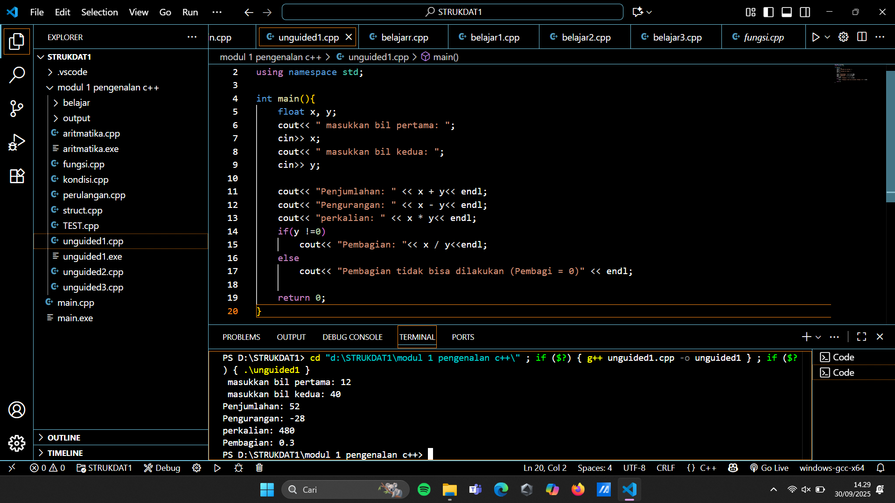
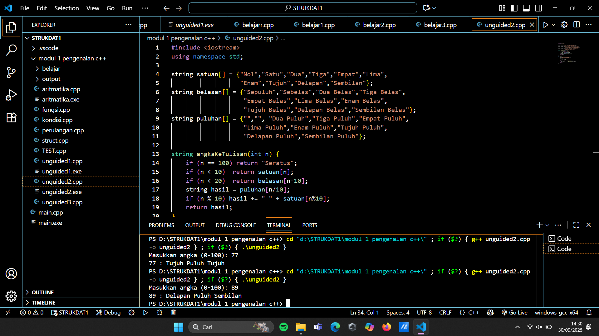
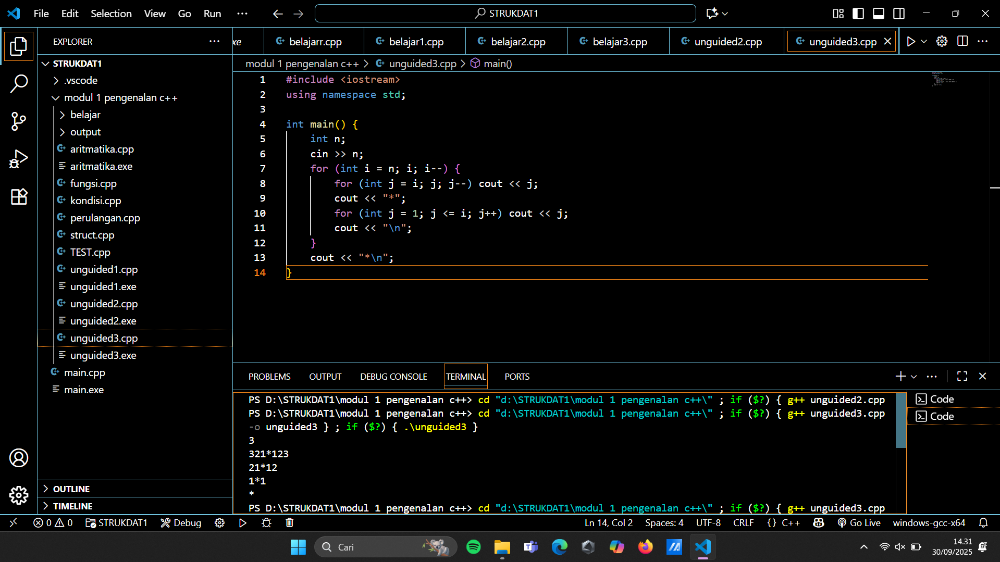

# <h1 align="center">Laporan Praktikum Modul X <br> Pengenalan C++</h1>
<p align="center">EIKEL PRINST SUKATENDEL - 103112430232</p>

## Dasar Teori

Dalam pengenalan bahasa C++ ini, dapat diketahui bahwasanya yang dimana kita dapat mengerti dalam fungsi input data yang dimana kita bisa membantu memecahkan program yang lebih kompleks dan efisien.
Ada beberapa contoh struktur data yang memiliki fungsi masing-masing
1.<iostream>: memberikan akses ke fungsi input dan output dalam C++
2.using namespace std :  bagian ini disebut deklarasi yang memberi tahu program untuk menggunakan namespace std yang berisi banyak fungsi dan objek standar.
3.int main() : bagian ini disebut deklarasi fungsi utama (main) yang merupakan pintu masuk eksekusi untuk program C++.

ini adalah bagian dasar dari pengertian struktur data


## Unguided

### soal 1

aku mengerjakan latihan menerima input-an dua buah yang bertipe float, kemudian memberikan output-an hasil penjumlahan, pengurangan, perkalian dan pembagian dari dua bilangan.

## Unguided

### Soal 1

hasil 

```go
#include <iostream>
using namespace std;

int main(){
    float x, y;
    cout<< " masukkan bil pertama: ";
    cin>> x;
    cout<< " masukkan bil kedua: ";
    cin>> y;

    cout<< "Penjumlahan: " << x + y<< endl;
    cout<< "Pengurangan: " << x - y<< endl;
    cout<< "perkalian: " << x * y<< endl;
    if(y !=0)
        cout<< "Pembagian: "<< x / y<<endl;
    else
        cout<< "Pembagian tidak bisa dilakukan (Pembagi = 0)" << endl;

    return 0;
}
```

> Output
> 


Dalam proses pembuatan Pseucode C++, dimana ada terdapat dua bilangan dan saya pisah menjadi X dan Y. Yang dimana X adalah bilangan pertama sedangkan Y adalah bialangan kedua dan dijadikan penyatuan di antara dua bilangan. dalam penggabungan dua bilangan untuk melihat hasil outputnya itu menggunakan float. Ada terdapat code yang menunjukkan else dan apa tujuan dari else tersebut? Penggunaan else sendiri itu jika nilai 0 itu tidak dapat atau hasil tidak ditemukan maka akan bisa diganti dengan nilai pembagi menjadi 0

### Soal 2

Buatlah sebuah program yang menerima masukan angka dan mengeluarkan angka output nilai angka tersebut dalam bentuk tulisan. Angka yang akan di input-kan user adalah bilangan bulat Positif mulai dari 0 s.d 100

Contoh: 79(Tujuh puluh sembilan)

```go
#include <iostream>
using namespace std;

string satuan[] = {"Nol","Satu","Dua","Tiga","Empat","Lima",
                   "Enam","Tujuh","Delapan","Sembilan"};
string belasan[] = {"Sepuluh","Sebelas","Dua Belas","Tiga Belas",
                    "Empat Belas","Lima Belas","Enam Belas",
                    "Tujuh Belas","Delapan Belas","Sembilan Belas"};
string puluhan[] = {"","", "Dua Puluh","Tiga Puluh","Empat Puluh",
                    "Lima Puluh","Enam Puluh","Tujuh Puluh",
                    "Delapan Puluh","Sembilan Puluh"};

string angkaKeTulisan(int n) {
    if (n == 100) return "Seratus";
    if (n < 10)  return satuan[n];
    if (n < 20)  return belasan[n-10];
    string hasil = puluhan[n/10];
    if (n % 10) hasil += " " + satuan[n%10];
    return hasil;
}

int main() {
    int n;
    cout << "Masukkan angka (0-100): ";
    cin >> n;

    if (n < 0 || n > 100) 
        cout << "Angka di luar jangkauan!\n";
    else 
        cout << n << " : " << angkaKeTulisan(n) << endl;

    return 0;
}

```

> Output
> 

penjelasan kode

Untuk mencari input-an angka menjadi dalam bentuk tulisan, untuk mencarinya kita harus membuat string untuk bisa mengelompokkan bilangan atau yang biasa disebut array. untuk jumlah stringnya terdapat 3 bagian yaitu satuan, belasan dan puluhan. Jika ada bilangan 100 maka kita gunakan if (jika input-annya tdak ada di array tersebut) begitu seterusnya, jika 10 maka masuk ke dalam belasan dan 20 akan masuk ke dalam array puluhan.

soal nomor 3

buatlah program yang dapat memberikan input dan output sbb.

cth:  input: 3

	  output:321*123
	  		  21*12
			   1*1

```go
#include <iostream>
using namespace std;

int main() {
    int n; 
    cin >> n;
    for (int i = n; i; i--) {
        for (int j = i; j; j--) cout << j;
        cout << "*";
        for (int j = 1; j <= i; j++) cout << j;
        cout << "\n";
    }
    cout << "*\n";
}`

```
> Output
> 

penjelasan

untuk membuat program input dan output menjadi seperti ada dua (mirror). Disini menggunakan teknik looping atau disebut berulang. Untuk membuatnya kita membuat cout << "*\n"; adalah sebagai titik mirrornya dan (i---) supaya pola bisa berkurang baris demi baris

## Referensi

1. https://en.wikipedia.org/wiki/Data_structure 
