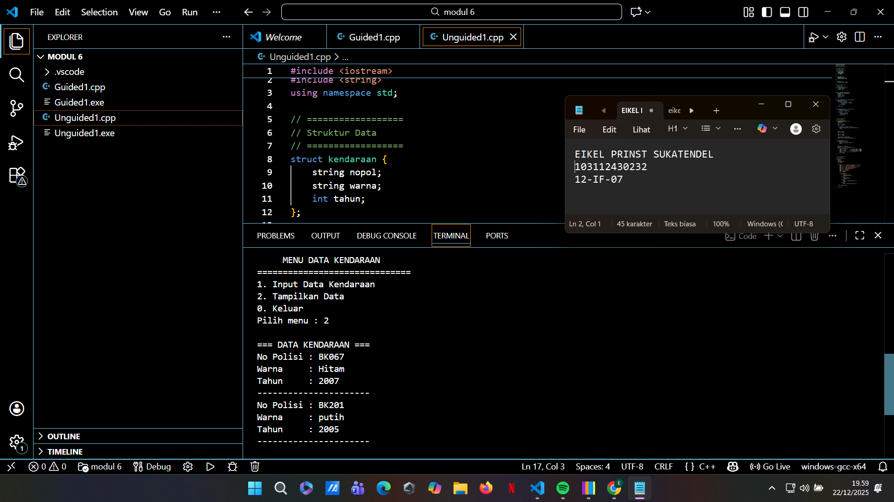
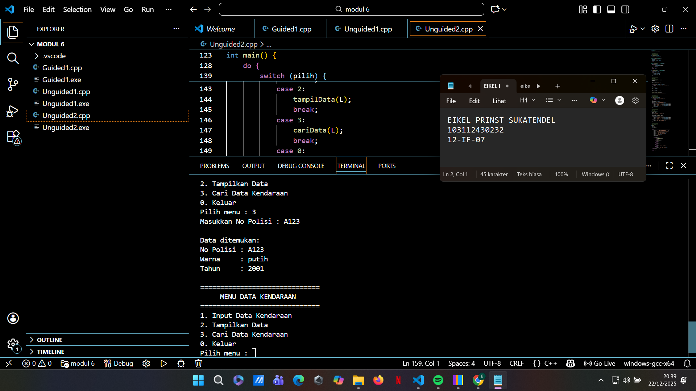
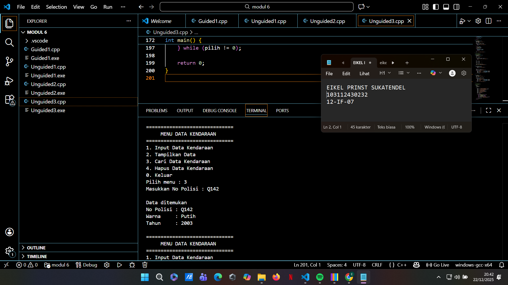
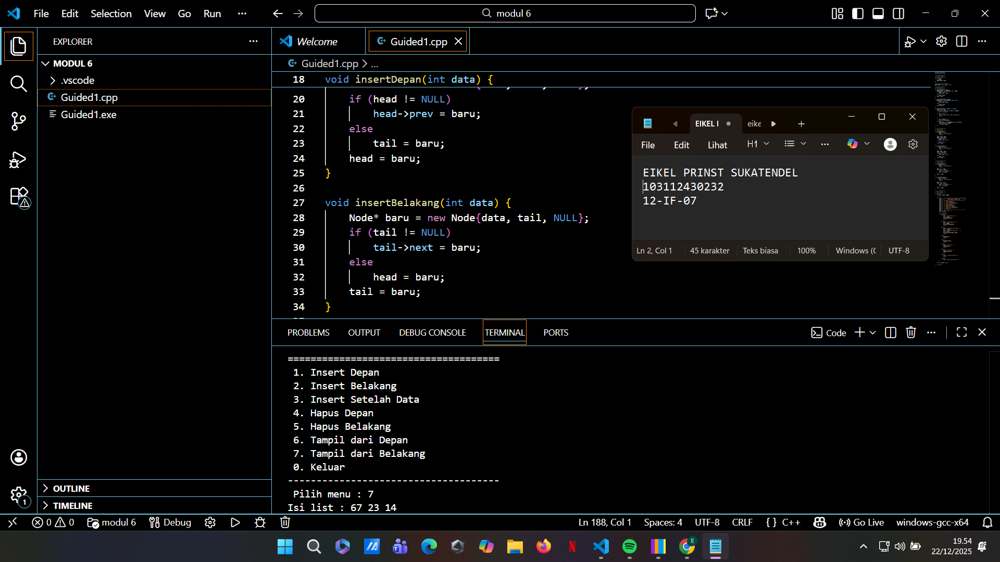

# <h1 align="center">Laporan Praktikum Modul 6 <br> Double Linkedlist</h1>
<p align="center">Eikel Prinst Sukatendel - 103112430232</p>

## Dasar Teori

1. Definisi dan Struktur Node

Linked list merupakan salah satu struktur data dinamis yang digunakan untuk menyimpan sekumpulan data yang saling terhubung secara berurutan. Data dalam linked list disimpan di dalam node, di mana setiap node memiliki informasi dan pointer yang menghubungkannya dengan node lain. Berbeda dengan struktur data statis, linked list tidak memiliki ukuran tetap karena memori dialokasikan secara dinamis sesuai dengan kebutuhan program.

2. Doubly Linked List

Doubly Linked List adalah pengembangan dari linked list yang setiap node-nya memiliki dua buah pointer. Pointer pertama (next) berfungsi untuk menunjuk ke node berikutnya, sedangkan pointer kedua (prev) menunjuk ke node sebelumnya. Selain itu, struktur ini menggunakan dua penanda utama, yaitu first sebagai penunjuk awal list dan last sebagai penunjuk akhir list, sehingga data dapat diakses dari dua arah.

3. Keunggulan Doubly Linked List

Kelebihan utama dari Doubly Linked List terletak pada fleksibilitas dalam penelusuran data. Struktur ini memungkinkan proses traversal dilakukan secara maju maupun mundur, sehingga mempermudah operasi pencarian, penghapusan, maupun pembaruan data. Dengan kemampuan tersebut, Doubly Linked List lebih efisien dalam pengelolaan data dibandingkan Singly Linked List pada kondisi tertentu.
## Guided

### soal 1

Program C++ ini menerapkan struktur data double linked list, yaitu sebuah list yang setiap node-nya memiliki dua pointer: prev untuk menunjuk ke node sebelumnya dan next untuk menunjuk ke node berikutnya. Dengan adanya dua arah ini, data dapat diakses dan dimanipulasi baik dari depan maupun dari belakang. Program menggunakan pointer global head dan tail untuk menandai awal dan akhir list.


```go
#include <iostream>
using namespace std;

// ==================
// Struktur Node
// ==================
struct Node {
    int data;
    Node *prev, *next;
};

// Pointer awal dan akhir
Node *head = NULL, *tail = NULL;

// ==================
// Fungsi Insert
// ==================
void insertDepan(int data) {
    Node* baru = new Node{data, NULL, head};
    if (head != NULL)
        head->prev = baru;
    else
        tail = baru;
    head = baru;
}

void insertBelakang(int data) {
    Node* baru = new Node{data, tail, NULL};
    if (tail != NULL)
        tail->next = baru;
    else
        head = baru;
    tail = baru;
}

void insertSetelah(int target, int data) {
    Node* cur = head;
    while (cur != NULL && cur->data != target)
        cur = cur->next;

    if (cur == NULL) {
        cout << "Data target tidak ditemukan!\n";
        return;
    }

    if (cur == tail) {
        insertBelakang(data);
    } else {
        Node* baru = new Node{data, cur, cur->next};
        cur->next->prev = baru;
        cur->next = baru;
    }
}

// ==================
// Fungsi Hapus
// ==================
void hapusDepan() {
    if (head == NULL) {
        cout << "List kosong!\n";
        return;
    }
    Node* temp = head;
    head = head->next;
    if (head != NULL)
        head->prev = NULL;
    else
        tail = NULL;
    delete temp;
}

void hapusBelakang() {
    if (tail == NULL) {
        cout << "List kosong!\n";
        return;
    }
    Node* temp = tail;
    tail = tail->prev;
    if (tail != NULL)
        tail->next = NULL;
    else
        head = NULL;
    delete temp;
}

// ==================
// Fungsi Tampil
// ==================
void tampilDepan() {
    if (head == NULL) {
        cout << "List kosong!\n";
        return;
    }
    Node* cur = head;
    while (cur != NULL) {
        cout << cur->data << " ";
        cur = cur->next;
    }
    cout << endl;
}

void tampilBelakang() {
    if (tail == NULL) {
        cout << "List kosong!\n";
        return;
    }
    Node* cur = tail;
    while (cur != NULL) {
        cout << cur->data << " ";
        cur = cur->prev;
    }
    cout << endl;
}

// ==================
// Main Program
// ==================
int main() {
    int pilih, data, target;

    do {
        cout << "\n=====================================\n";
        cout << "        MENU DOUBLE LINKED LIST       \n";
        cout << "=====================================\n";
        cout << " 1. Insert Depan\n";
        cout << " 2. Insert Belakang\n";
        cout << " 3. Insert Setelah Data\n";
        cout << " 4. Hapus Depan\n";
        cout << " 5. Hapus Belakang\n";
        cout << " 6. Tampil dari Depan\n";
        cout << " 7. Tampil dari Belakang\n";
        cout << " 0. Keluar\n";
        cout << "-------------------------------------\n";
        cout << " Pilih menu : ";
        cin >> pilih;

        switch (pilih) {
            case 1:
                cout << "Masukkan data : ";
                cin >> data;
                insertDepan(data);
                break;

            case 2:
                cout << "Masukkan data : ";
                cin >> data;
                insertBelakang(data);
                break;

            case 3:
                cout << "Masukkan data target : ";
                cin >> target;
                cout << "Masukkan data baru   : ";
                cin >> data;
                insertSetelah(target, data);
                break;

            case 4:
                hapusDepan();
                break;

            case 5:
                hapusBelakang();
                break;

            case 6:
                cout << "Isi list : ";
                tampilDepan();
                break;

            case 7:
                cout << "Isi list : ";
                tampilBelakang();
                break;

            case 0:
                cout << "Program selesai.\n";
                break;

            default:
                cout << "Menu tidak valid!\n";
        }

    } while (pilih != 0);

    return 0;
}

```

> Output
> 

## Unguided

### Soal 1


```go
#include <iostream>
#include <string>
using namespace std;

// ==================
// Struktur Data
// ==================
struct kendaraan {
    string nopol;
    string warna;
    int tahun;
};

struct elmlist {
    kendaraan info;
    elmlist *next, *prev;
};

struct List {
    elmlist *First, *Last;
};

// ==================
// Fungsi Dasar
// ==================
void createList(List &L) {
    L.First = NULL;
    L.Last = NULL;
}

elmlist* alokasi(kendaraan x) {
    elmlist* p = new elmlist;
    p->info = x;
    p->next = NULL;
    p->prev = NULL;
    return p;
}

elmlist* findElm(List L, string nopol) {
    elmlist* p = L.First;
    while (p != NULL) {
        if (p->info.nopol == nopol)
            return p;
        p = p->next;
    }
    return NULL;
}

void insertFirst(List &L, elmlist* p) {
    if (L.First == NULL) {
        L.First = L.Last = p;
    } else {
        p->next = L.First;
        L.First->prev = p;
        L.First = p;
    }
}

// ==================
// Input & Output
// ==================
void inputKendaraan(List &L) {
    kendaraan x;

    cout << "No Polisi : ";
    cin >> x.nopol;

    if (findElm(L, x.nopol) != NULL) {
        cout << "Nomor polisi sudah terdaftar!\n";
        return;
    }

    cout << "Warna     : ";
    cin >> x.warna;

    cout << "Tahun     : ";
    cin >> x.tahun;

    insertFirst(L, alokasi(x));
    cout << "Data berhasil ditambahkan.\n";
}

void tampilData(List L) {
    if (L.First == NULL) {
        cout << "List masih kosong.\n";
        return;
    }

    elmlist* p = L.First;
    cout << "\n=== DATA KENDARAAN ===\n";
    while (p != NULL) {
        cout << "No Polisi : " << p->info.nopol << endl;
        cout << "Warna     : " << p->info.warna << endl;
        cout << "Tahun     : " << p->info.tahun << endl;
        cout << "----------------------\n";
        p = p->next;
    }
}

// ==================
// Main Program
// ==================
int main() {
    List L;
    createList(L);
    int pilih;

    do {
        cout << "\n==============================\n";
        cout << "     MENU DATA KENDARAAN      \n";
        cout << "==============================\n";
        cout << "1. Input Data Kendaraan\n";
        cout << "2. Tampilkan Data\n";
        cout << "0. Keluar\n";
        cout << "Pilih menu : ";
        cin >> pilih;

        switch (pilih) {
            case 1:
                inputKendaraan(L);
                break;
            case 2:
                tampilData(L);
                break;
            case 0:
                cout << "Program selesai.\n";
                break;
            default:
                cout << "Menu tidak valid!\n";
        }
    } while (pilih != 0);

    return 0;
}

```

> Output
> 
> %% Untuk mencantumkan screenshot, tidak boleh ada spasi di urlnya `()`, penamaan file bebas asal gak sara dan mudah dipahami aja,, dan jangan lupa hapus komen ini yah%%

Program menyediakan menu interaktif untuk memasukkan data kendaraan dan menampilkan seluruh data yang ada di dalam list. Saat memasukkan data, sistem akan mengecek apakah nomor polisi sudah terdaftar atau belum untuk menghindari data duplikat. Dengan menu yang sederhana dan tampilan yang rapi, program ini memudahkan pengguna dalam memahami cara kerja double linked list secara praktis.

### Soal 2

soal nomor 2A

```go
#include <iostream>
#include <string>
using namespace std;

// ==================
// Struktur Data
// ==================
struct kendaraan {
    string nopol;
    string warna;
    int tahun;
};

struct elmlist {
    kendaraan info;
    elmlist *next, *prev;
};

struct List {
    elmlist *First, *Last;
};

// ==================
// Fungsi Dasar
// ==================
void createList(List &L) {
    L.First = L.Last = NULL;
}

elmlist* alokasi(kendaraan x) {
    elmlist* p = new elmlist;
    p->info = x;
    p->next = p->prev = NULL;
    return p;
}

elmlist* findElm(List L, string nopol) {
    elmlist* p = L.First;
    while (p != NULL) {
        if (p->info.nopol == nopol)
            return p;
        p = p->next;
    }
    return NULL;
}

void insertFirst(List &L, elmlist* p) {
    if (L.First == NULL) {
        L.First = L.Last = p;
    } else {
        p->next = L.First;
        L.First->prev = p;
        L.First = p;
    }
}

// ==================
// Input Data
// ==================
void inputKendaraan(List &L) {
    kendaraan x;

    cout << "No Polisi : ";
    cin >> x.nopol;

    if (findElm(L, x.nopol) != NULL) {
        cout << "Nomor polisi sudah terdaftar!\n";
        return;
    }

    cout << "Warna     : ";
    cin >> x.warna;

    cout << "Tahun     : ";
    cin >> x.tahun;

    insertFirst(L, alokasi(x));
    cout << "Data berhasil ditambahkan.\n";
}

// ==================
// Tampil Data
// ==================
void tampilData(List L) {
    if (L.First == NULL) {
        cout << "Data masih kosong.\n";
        return;
    }

    elmlist* p = L.First;
    cout << "\n=== DATA KENDARAAN ===\n";
    while (p != NULL) {
        cout << "No Polisi : " << p->info.nopol << endl;
        cout << "Warna     : " << p->info.warna << endl;
        cout << "Tahun     : " << p->info.tahun << endl;
        cout << "----------------------\n";
        p = p->next;
    }
}

// ==================
// Cari Data
// ==================
void cariData(List L) {
    string cari;
    cout << "Masukkan No Polisi : ";
    cin >> cari;

    elmlist* p = findElm(L, cari);
    if (p != NULL) {
        cout << "\nData ditemukan:\n";
        cout << "No Polisi : " << p->info.nopol << endl;
        cout << "Warna     : " << p->info.warna << endl;
        cout << "Tahun     : " << p->info.tahun << endl;
    } else {
        cout << "Data tidak ditemukan.\n";
    }
}

// ==================
// Main Program
// ==================
int main() {
    List L;
    createList(L);
    int pilih;

    do {
        cout << "\n==============================\n";
        cout << "     MENU DATA KENDARAAN      \n";
        cout << "==============================\n";
        cout << "1. Input Data Kendaraan\n";
        cout << "2. Tampilkan Data\n";
        cout << "3. Cari Data Kendaraan\n";
        cout << "0. Keluar\n";
        cout << "Pilih menu : ";
        cin >> pilih;

        switch (pilih) {
            case 1:
                inputKendaraan(L);
                break;
            case 2:
                tampilData(L);
                break;
            case 3:
                cariData(L);
                break;
            case 0:
                cout << "Program selesai.\n";
                break;
            default:
                cout << "Menu tidak valid!\n";
        }
    } while (pilih != 0);

    return 0;
}

```

> Output
> 

penjelasan kode
Program menyediakan menu interaktif untuk menambah data kendaraan, menampilkan seluruh data, serta mencari kendaraan berdasarkan nomor polisi. Sebelum data dimasukkan, sistem akan melakukan pengecekan agar tidak terjadi duplikasi nomor polisi. Dengan tampilan menu yang rapi dan fungsi yang terpisah, program ini memudahkan pengguna memahami penerapan double linked list dalam pengelolaan data sederhana.
Kalau adalanjutan di lanjut disini aja

soal nomor 2B

```go
#include <iostream>
#include <string>
using namespace std;

// ==================
// Struktur Data
// ==================
struct kendaraan {
    string nopol;
    string warna;
    int tahun;
};

struct elmlist {
    kendaraan info;
    elmlist *next, *prev;
};

struct List {
    elmlist *First, *Last;
};

// ==================
// Fungsi Dasar
// ==================
void createList(List &L) {
    L.First = L.Last = NULL;
}

elmlist* alokasi(kendaraan x) {
    elmlist* p = new elmlist;
    p->info = x;
    p->next = p->prev = NULL;
    return p;
}

elmlist* findElm(List L, string nopol) {
    elmlist* p = L.First;
    while (p != NULL) {
        if (p->info.nopol == nopol)
            return p;
        p = p->next;
    }
    return NULL;
}

void insertFirst(List &L, elmlist* p) {
    if (L.First == NULL) {
        L.First = L.Last = p;
    } else {
        p->next = L.First;
        L.First->prev = p;
        L.First = p;
    }
}

// ==================
// Delete
// ==================
void deleteFirst(List &L) {
    if (L.First == NULL) return;

    elmlist* p = L.First;
    L.First = p->next;

    if (L.First != NULL)
        L.First->prev = NULL;
    else
        L.Last = NULL;

    delete p;
}

void deleteLast(List &L) {
    if (L.Last == NULL) return;

    elmlist* p = L.Last;
    L.Last = p->prev;

    if (L.Last != NULL)
        L.Last->next = NULL;
    else
        L.First = NULL;

    delete p;
}

void deleteData(List &L) {
    string hapus;
    cout << "Masukkan No Polisi : ";
    cin >> hapus;

    elmlist* p = findElm(L, hapus);
    if (p == NULL) {
        cout << "Data tidak ditemukan.\n";
        return;
    }

    if (p == L.First)
        deleteFirst(L);
    else if (p == L.Last)
        deleteLast(L);
    else {
        p->prev->next = p->next;
        p->next->prev = p->prev;
        delete p;
    }

    cout << "Data berhasil dihapus.\n";
}

// ==================
// Input & Output
// ==================
void inputKendaraan(List &L) {
    kendaraan x;

    cout << "No Polisi : ";
    cin >> x.nopol;

    if (findElm(L, x.nopol) != NULL) {
        cout << "Nomor polisi sudah terdaftar!\n";
        return;
    }

    cout << "Warna     : ";
    cin >> x.warna;

    cout << "Tahun     : ";
    cin >> x.tahun;

    insertFirst(L, alokasi(x));
    cout << "Data berhasil ditambahkan.\n";
}

void tampilData(List L) {
    if (L.First == NULL) {
        cout << "Data masih kosong.\n";
        return;
    }

    elmlist* p = L.First;
    cout << "\n=== DATA KENDARAAN ===\n";
    while (p != NULL) {
        cout << "No Polisi : " << p->info.nopol << endl;
        cout << "Warna     : " << p->info.warna << endl;
        cout << "Tahun     : " << p->info.tahun << endl;
        cout << "----------------------\n";
        p = p->next;
    }
}

void cariData(List L) {
    string cari;
    cout << "Masukkan No Polisi : ";
    cin >> cari;

    elmlist* p = findElm(L, cari);
    if (p != NULL) {
        cout << "\nData ditemukan\n";
        cout << "No Polisi : " << p->info.nopol << endl;
        cout << "Warna     : " << p->info.warna << endl;
        cout << "Tahun     : " << p->info.tahun << endl;
    } else {
        cout << "Data tidak ditemukan.\n";
    }
}

// ==================
// Main Program
// ==================
int main() {
    List L;
    createList(L);
    int pilih;

    do {
        cout << "\n==============================\n";
        cout << "     MENU DATA KENDARAAN      \n";
        cout << "==============================\n";
        cout << "1. Input Data Kendaraan\n";
        cout << "2. Tampilkan Data\n";
        cout << "3. Cari Data Kendaraan\n";
        cout << "4. Hapus Data Kendaraan\n";
        cout << "0. Keluar\n";
        cout << "Pilih menu : ";
        cin >> pilih;

        switch (pilih) {
            case 1: inputKendaraan(L); break;
            case 2: tampilData(L); break;
            case 3: cariData(L); break;
            case 4: deleteData(L); break;
            case 0: cout << "Program selesai.\n"; break;
            default: cout << "Menu tidak valid!\n";
        }
    } while (pilih != 0);

    return 0;
}

```

> Output
> 

penjelasan 
  Melalui menu interaktif, pengguna dapat menambahkan data kendaraan, menampilkan seluruh data, mencari data berdasarkan nomor polisi, serta menghapus data tertentu. Sebelum data dimasukkan, program akan melakukan pengecekan agar tidak terjadi duplikasi nomor polisi. Dengan pembagian fungsi yang jelas dan tampilan menu yang rapi, program ini memudahkan pemahaman konsep double linked list dalam pengolahan data sederhana.

## Referensi

1. Guna, L. A. (2022). Implementasi Prosedur dan Fungsi Dalam Bahasa Pemrograman Python. Jurnal Portal Data, 2(1). Diakses melalui https://ejurnal-bpptik.kominfo.go.id/index.php/jpd/article/view/118.
2. https://www.programiz.com/cpp-programming/examples/linked-list(diakses dalam pengertian cpp lengkap)
