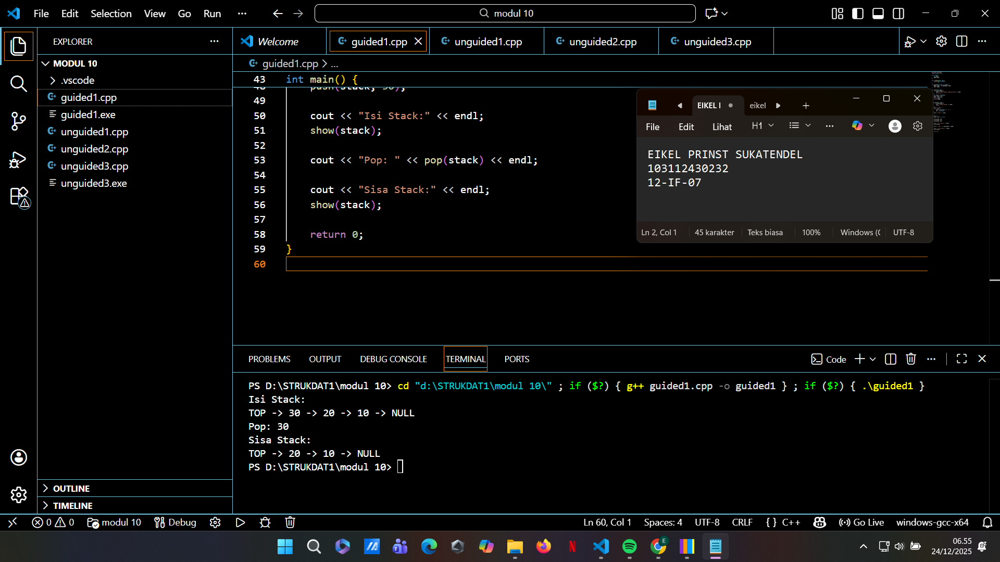
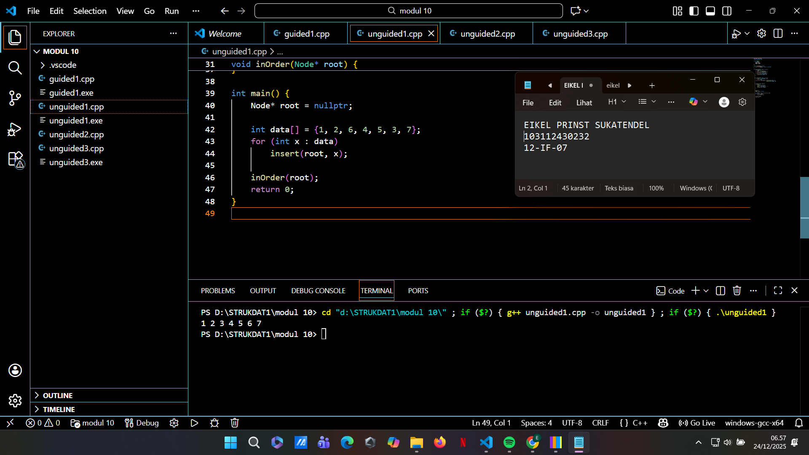
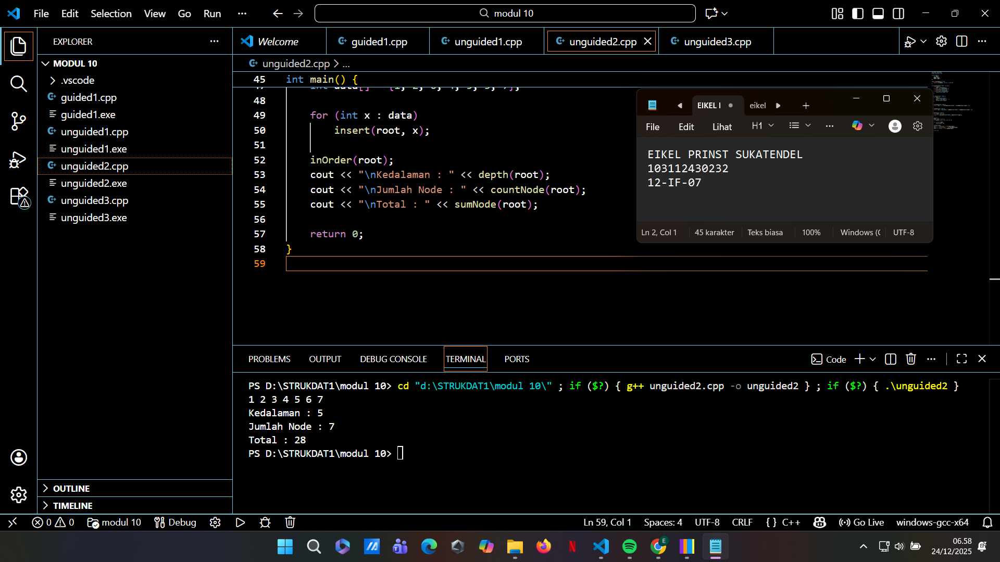
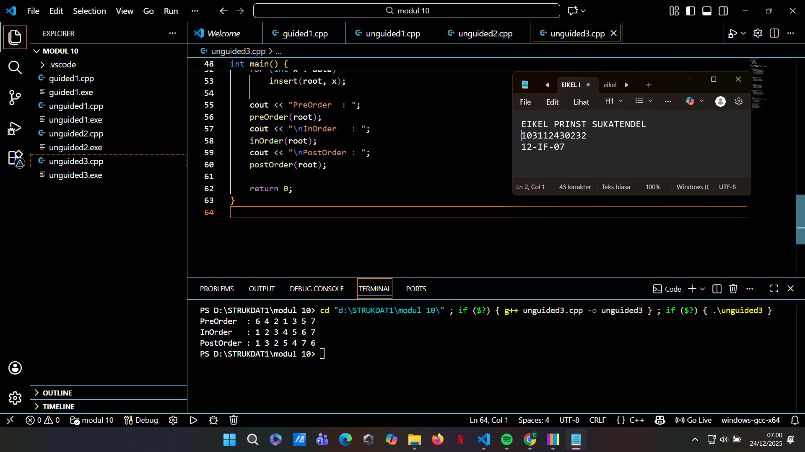

# <h1 align="center">Laporan Praktikum Modul 10 <br> REKURSIF</h1>
<p align="center">EIKEL PRINST SUKATENDEL - 103112430232</p>

## Dasar Teori
Pada modul ini dipelajari dua konsep utama, yaitu fungsi rekursif dan struktur data Tree. Rekursif merupakan teknik pemrograman di mana sebuah fungsi memanggil dirinya sendiri untuk menyelesaikan masalah secara bertahap. Agar tidak terjadi pemanggilan tanpa akhir, rekursif harus memiliki base case sebagai kondisi penghenti. Walaupun membuat kode lebih ringkas dan mudah dipahami, penggunaan rekursif perlu diperhatikan karena dapat mengonsumsi memori lebih besar akibat penyimpanan proses pemanggilan fungsi.

Selain itu, dibahas pula struktur data Tree, khususnya Binary Search Tree (BST). Tree adalah struktur non-linear yang bersifat hierarkis, terdiri dari root, child, dan leaf. Pada BST, data yang lebih kecil dari parent ditempatkan di subtree kiri, sedangkan data yang lebih besar berada di subtree kanan, sehingga proses pencarian dan penyisipan data menjadi lebih efisien. Untuk menampilkan isi Tree, digunakan metode traversal yaitu Pre-order, In-order, dan Post-order. Khusus pada BST, traversal In-order menghasilkan data yang tersusun otomatis dari nilai terkecil hingga terbesar.

## Guided

### soal 1

```go
#include <iostream>
using namespace std;

struct Node {
    int data;
    Node* next;
};

bool isEmpty(Node* top) {
    return top == nullptr;
}

void push(Node*& top, int data) {
    Node* node = new Node{data, top};
    top = node;
}

int pop(Node*& top) {
    if (isEmpty(top)) {
        cout << "Stack kosong, tidak bisa pop!" << endl;
        return -1;
    }
    int value = top->data;
    Node* temp = top;
    top = top->next;
    delete temp;
    return value;
}

void show(Node* top) {
    if (isEmpty(top)) {
        cout << "Stack kosong." << endl;
        return;
    }
    cout << "TOP -> ";
    while (top) {
        cout << top->data << " -> ";
        top = top->next;
    }
    cout << "NULL" << endl;
}

int main() {
    Node* stack = nullptr;

    push(stack, 10);
    push(stack, 20);
    push(stack, 30);

    cout << "Isi Stack:" << endl;
    show(stack);

    cout << "Pop: " << pop(stack) << endl;

    cout << "Sisa Stack:" << endl;
    show(stack);

    return 0;
}

```
> Output
> 
> %% Untuk mencantumkan screenshot, tidak boleh ada spasi di urlnya `()`, penamaan file bebas asal gak sara dan mudah dipahami aja,, dan jangan lupa hapus komen ini yah%%

Penjelasan
Program ini mengimplementasikan struktur data stack menggunakan linked list dengan pointer sebagai penghubung antar node. Setiap node menyimpan sebuah nilai integer (data) dan alamat node berikutnya (next). Pointer top berfungsi sebagai penanda elemen paling atas dalam stack, sehingga operasi stack dapat dilakukan secara efisien tanpa batasan ukuran tetap seperti pada array.

Fungsi push menambahkan data baru ke bagian atas stack dengan membuat node baru dan menghubungkannya ke node sebelumnya. Sebaliknya, fungsi pop menghapus node teratas dengan memindahkan pointer top ke node berikutnya dan menghapus node lama dari memori. Fungsi show digunakan untuk menampilkan seluruh isi stack dari atas ke bawah. Dengan pendekatan linked list ini, stack menjadi lebih fleksibel karena tidak bergantung pada ukuran maksimum dan penggunaan memori menjadi dinamis.

## Unguided

### Soal 1


```go
#include <iostream>
using namespace std;

struct Node {
    int data;
    Node* left;
    Node* right;
};

Node* createNode(int x) {
    return new Node{x, nullptr, nullptr};
}

void insert(Node*& root, int x) {
    if (!root) {
        root = createNode(x);
    } else if (x < root->data) {
        insert(root->left, x);
    } else if (x > root->data) {
        insert(root->right, x);
    }
}

Node* search(Node* root, int x) {
    if (!root || root->data == x)
        return root;
    return (x < root->data) ? search(root->left, x)
                            : search(root->right, x);
}

void inOrder(Node* root) {
    if (root) {
        inOrder(root->left);
        cout << root->data << " ";
        inOrder(root->right);
    }
}

int main() {
    Node* root = nullptr;

    int data[] = {1, 2, 6, 4, 5, 3, 7};
    for (int x : data)
        insert(root, x);

    inOrder(root);
    return 0;
}

```

> Output
> 
> %% Untuk mencantumkan screenshot, tidak boleh ada spasi di urlnya `()`, penamaan file bebas asal gak sara dan mudah dipahami aja,, dan jangan lupa hapus komen ini yah%%

Penjelasan 
  Program ini mengimplementasikan Binary Search Tree (BST) menggunakan struktur data berbasis pointer. Setiap node menyimpan sebuah nilai serta dua pointer yang menunjuk ke anak kiri dan kanan. Proses penyisipan data (insert) dilakukan secara rekursif dengan aturan BST, yaitu nilai yang lebih kecil disimpan di subtree kiri dan nilai yang lebih besar di subtree kanan, sehingga struktur tree tetap terurut.

Selain itu, fungsi search digunakan untuk mencari data tertentu secara efisien dengan membandingkan nilai pada setiap node. Untuk menampilkan isi tree, digunakan In-order traversal, di mana subtree kiri diproses terlebih dahulu, kemudian root, dan terakhir subtree kanan. Karena traversal ini diterapkan pada BST, hasil output yang ditampilkan otomatis tersusun dari nilai terkecil hingga terbesar.
### Soal 2

soal nomor 2

```go
#include <iostream>
using namespace std;

struct Node {
    int data;
    Node* left;
    Node* right;
};

Node* createNode(int x) {
    return new Node{x, nullptr, nullptr};
}

void insert(Node*& root, int x) {
    if (!root) {
        root = createNode(x);
    } else if (x < root->data) {
        insert(root->left, x);
    } else if (x > root->data) {
        insert(root->right, x);
    }
}

void inOrder(Node* root) {
    if (root) {
        inOrder(root->left);
        cout << root->data << " ";
        inOrder(root->right);
    }
}

int countNode(Node* root) {
    return root ? 1 + countNode(root->left) + countNode(root->right) : 0;
}

int sumNode(Node* root) {
    return root ? root->data + sumNode(root->left) + sumNode(root->right) : 0;
}

int depth(Node* root) {
    if (!root) return 0;
    return 1 + max(depth(root->left), depth(root->right));
}

int main() {
    Node* root = nullptr;
    int data[] = {1, 2, 6, 4, 5, 3, 7};

    for (int x : data)
        insert(root, x);

    inOrder(root);
    cout << "\nKedalaman : " << depth(root);
    cout << "\nJumlah Node : " << countNode(root);
    cout << "\nTotal : " << sumNode(root);

    return 0;
}

```

> Output
> 

penjelasan 
  Program ini merupakan implementasi Binary Search Tree (BST) yang memanfaatkan fungsi rekursif untuk mengelola data. Setiap node menyimpan satu nilai dan dua pointer yang mengarah ke anak kiri dan kanan. Proses penyisipan data dilakukan dengan aturan BST, yaitu nilai yang lebih kecil ditempatkan di subtree kiri dan nilai yang lebih besar di subtree kanan, sehingga struktur pohon tetap terurut dan efisien untuk pencarian.

Selain menampilkan data menggunakan In-order traversal (yang menghasilkan urutan dari nilai terkecil ke terbesar), program ini juga menghitung jumlah node, total nilai seluruh node, dan kedalaman tree. Semua perhitungan tersebut dilakukan secara rekursif, sehingga kode menjadi lebih ringkas, terstruktur, dan mudah dipahami meskipun menangani struktur data non-linear seperti Tree.

soal nomor 3

```go
#include <iostream>
using namespace std;

struct Node {
    int data;
    Node* left;
    Node* right;
};

Node* createNode(int x) {
    return new Node{x, nullptr, nullptr};
}

void insert(Node*& root, int x) {
    if (!root) {
        root = createNode(x);
    } else if (x < root->data) {
        insert(root->left, x);
    } else if (x > root->data) {
        insert(root->right, x);
    }
}

void preOrder(Node* root) {
    if (root) {
        cout << root->data << " ";
        preOrder(root->left);
        preOrder(root->right);
    }
}

void inOrder(Node* root) {
    if (root) {
        inOrder(root->left);
        cout << root->data << " ";
        inOrder(root->right);
    }
}

void postOrder(Node* root) {
    if (root) {
        postOrder(root->left);
        postOrder(root->right);
        cout << root->data << " ";
    }
}

int main() {
    Node* root = nullptr;
    int data[] = {6, 4, 7, 2, 5, 1, 3};

    for (int x : data)
        insert(root, x);

    cout << "PreOrder  : ";
    preOrder(root);
    cout << "\nInOrder   : ";
    inOrder(root);
    cout << "\nPostOrder : ";
    postOrder(root);

    return 0;
}

```

> Output
> 

penjelasan 
  Program ini mengimplementasikan Binary Search Tree (BST) dengan tiga metode traversal utama, yaitu Pre-order, In-order, dan Post-order. Penyisipan data dilakukan secara rekursif berdasarkan aturan BST, di mana nilai yang lebih kecil dari node induk ditempatkan di subtree kiri, sedangkan nilai yang lebih besar berada di subtree kanan. Dengan aturan ini, struktur tree tetap terorganisir dan mendukung operasi yang efisien.

Traversal digunakan untuk menelusuri dan menampilkan isi tree dengan urutan yang berbeda. Pre-order mencetak data mulai dari root, lalu subtree kiri dan kanan. In-order menelusuri subtree kiri terlebih dahulu sehingga pada BST menghasilkan data yang terurut dari kecil ke besar. Sementara itu, Post-order mencetak node setelah seluruh anaknya diproses, yang sering digunakan pada proses penghapusan atau evaluasi struktur tree.

## Referensi

1.Laboratorium Informatika. (2025). Modul 10: Tree (Bagian Pertama). Fakultas Informatika, Telkom University. 
2.Lipschutz, S. (2014). Data Structures with C (Schaum’s Outline Series). McGraw-Hill Education.
