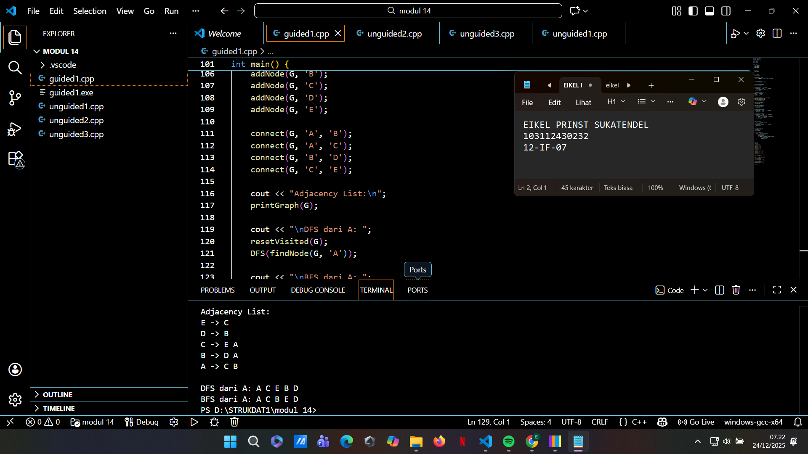
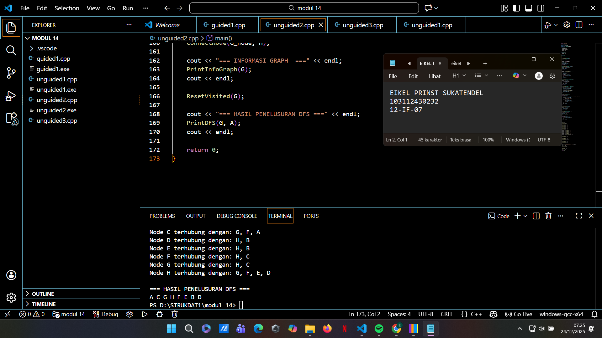
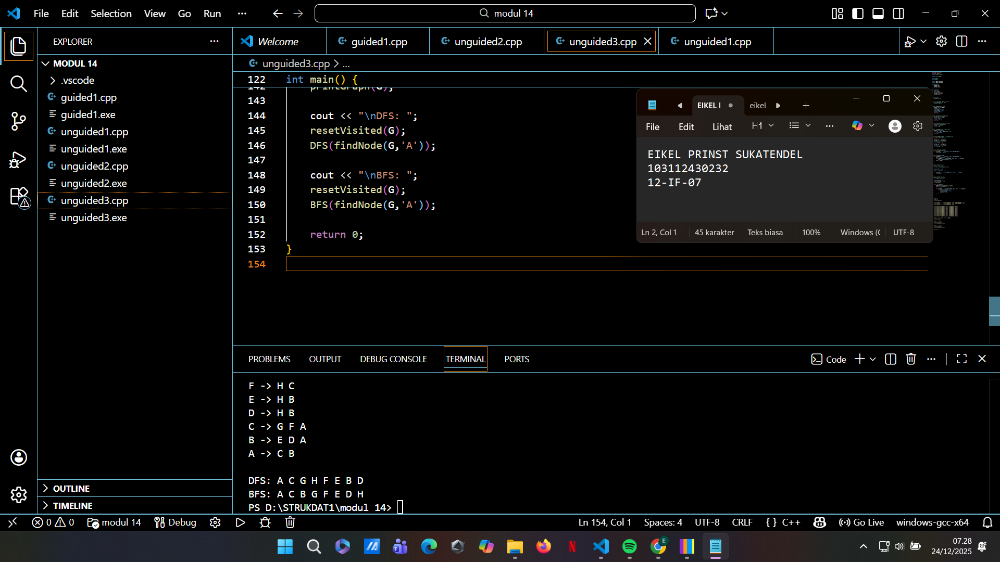

# <h1 align="center">Laporan Praktikum Modul 14 <br> GRAPH</h1>
<p align="center">EIKEL PRINST SUKATENDEL - 103112430232</p>

## Dasar Teori
Graph merupakan struktur data non-linear yang digunakan untuk merepresentasikan hubungan antar objek, terdiri dari kumpulan node (vertex) dan edge sebagai penghubungnya, yang secara formal dituliskan sebagai G(V, E). Berdasarkan arah hubungannya, graph dibedakan menjadi Directed Graph yang memiliki arah tertentu dan Undirected Graph yang bersifat dua arah. Selain itu, graph juga dapat berbobot (weighted graph) untuk merepresentasikan nilai tertentu seperti jarak, serta memiliki konsep adjacency yang menunjukkan hubungan langsung antar node.

Dalam pemrograman, graph dapat direpresentasikan menggunakan matriks ketetanggaan atau linked list, di mana representasi linked list lebih efisien secara memori dan bersifat dinamis. Untuk menelusuri graph, digunakan dua algoritma utama yaitu Breadth First Search (BFS) yang melakukan penelusuran secara melebar dengan bantuan queue, dan Depth First Search (DFS) yang menelusuri graph secara mendalam menggunakan stack. Konsep representasi dan traversal ini menjadi dasar bagi pengembangan algoritma lanjutan seperti pencarian jalur terpendek dan topological sorting.

## Guided

### soal 1

```go
#include <iostream>
#include <queue>
using namespace std;

struct Edge;
struct Node;

struct Node {
    char data;
    bool visited;
    Edge* edge;
    Node* next;
};

struct Edge {
    Node* to;
    Edge* next;
};

struct Graph {
    Node* first;
};

Node* newNode(char x) {
    return new Node{x, false, nullptr, nullptr};
}

Edge* newEdge(Node* n) {
    return new Edge{n, nullptr};
}

void initGraph(Graph& G) {
    G.first = nullptr;
}

Node* findNode(Graph G, char x) {
    for (Node* p = G.first; p; p = p->next)
        if (p->data == x) return p;
    return nullptr;
}

void addNode(Graph& G, char x) {
    Node* p = newNode(x);
    p->next = G.first;
    G.first = p;
}

void connect(Graph& G, char a, char b) {
    Node* n1 = findNode(G, a);
    Node* n2 = findNode(G, b);
    if (!n1 || !n2) return;

    Edge* e1 = newEdge(n2);
    e1->next = n1->edge;
    n1->edge = e1;

    Edge* e2 = newEdge(n1);
    e2->next = n2->edge;
    n2->edge = e2;
}

void resetVisited(Graph& G) {
    for (Node* p = G.first; p; p = p->next)
        p->visited = false;
}

void printGraph(Graph G) {
    for (Node* p = G.first; p; p = p->next) {
        cout << p->data << " -> ";
        for (Edge* e = p->edge; e; e = e->next)
            cout << e->to->data << " ";
        cout << endl;
    }
}

void DFS(Node* n) {
    if (!n || n->visited) return;
    n->visited = true;
    cout << n->data << " ";
    for (Edge* e = n->edge; e; e = e->next)
        DFS(e->to);
}

void BFS(Node* start) {
    if (!start) return;
    queue<Node*> q;
    q.push(start);

    while (!q.empty()) {
        Node* n = q.front(); q.pop();
        if (!n->visited) {
            n->visited = true;
            cout << n->data << " ";
            for (Edge* e = n->edge; e; e = e->next)
                if (!e->to->visited)
                    q.push(e->to);
        }
    }
}

int main() {
    Graph G;
    initGraph(G);

    addNode(G, 'A');
    addNode(G, 'B');
    addNode(G, 'C');
    addNode(G, 'D');
    addNode(G, 'E');

    connect(G, 'A', 'B');
    connect(G, 'A', 'C');
    connect(G, 'B', 'D');
    connect(G, 'C', 'E');

    cout << "Adjacency List:\n";
    printGraph(G);

    cout << "\nDFS dari A: ";
    resetVisited(G);
    DFS(findNode(G, 'A'));

    cout << "\nBFS dari A: ";
    resetVisited(G);
    BFS(findNode(G, 'A'));

    return 0;
}

```

> Output
> 
> %% Untuk mencantumkan screenshot, tidak boleh ada spasi di urlnya `()`, penamaan file bebas asal gak sara dan mudah dipahami aja,, dan jangan lupa hapus komen ini yah%%

Penjelasan

Program ini merupakan implementasi graph tidak berarah (undirected graph) menggunakan adjacency list berbasis linked list. Setiap node menyimpan data, status kunjungan (visited), serta pointer ke daftar edge yang menunjukkan node-node tetangganya. Struktur ini lebih hemat memori dan fleksibel dibandingkan matriks ketetanggaan, terutama untuk graph dengan jumlah edge yang tidak terlalu padat.

Program juga menerapkan dua algoritma traversal utama, yaitu Depth First Search (DFS) dan Breadth First Search (BFS). DFS menelusuri graph secara mendalam dengan memanfaatkan pemanggilan rekursif, sedangkan BFS menelusuri graph secara melebar menggunakan struktur queue. Kedua metode ini penting untuk memahami alur konektivitas graph dan menjadi dasar bagi algoritma lanjutan seperti pencarian jalur terpendek dan analisis struktur jaringan.
## Unguided

### Soal 1


```go
#include <iostream>
using namespace std;

struct Edge;
struct Node;

struct Node {
    char data;
    Edge* edge;
    Node* next;
};

struct Edge {
    Node* to;
    Edge* next;
};

struct Graph {
    Node* first;
};

void initGraph(Graph& G) {
    G.first = nullptr;
}

Node* createNode(char x) {
    return new Node{x, nullptr, nullptr};
}

Edge* createEdge(Node* n) {
    return new Edge{n, nullptr};
}

void insertNode(Graph& G, char x) {
    Node* p = createNode(x);
    if (!G.first) G.first = p;
    else {
        Node* q = G.first;
        while (q->next) q = q->next;
        q->next = p;
    }
}

Node* findNode(Graph G, char x) {
    for (Node* p = G.first; p; p = p->next)
        if (p->data == x) return p;
    return nullptr;
}

void connect(Node* a, Node* b) {
    if (!a || !b) return;

    Edge* e1 = createEdge(b);
    e1->next = a->edge;
    a->edge = e1;

    Edge* e2 = createEdge(a);
    e2->next = b->edge;
    b->edge = e2;
}

void printGraph(Graph G) {
    for (Node* p = G.first; p; p = p->next) {
        cout << p->data << " : ";
        if (!p->edge) cout << "(tidak ada)";
        for (Edge* e = p->edge; e; e = e->next)
            cout << e->to->data << " ";
        cout << endl;
    }
}

int main() {
    Graph G;
    initGraph(G);

    char nodes[] = {'A','B','C','D','E','F','G','H'};
    for (char x : nodes)
        insertNode(G, x);

    connect(findNode(G,'A'), findNode(G,'B'));
    connect(findNode(G,'A'), findNode(G,'C'));
    connect(findNode(G,'B'), findNode(G,'D'));
    connect(findNode(G,'B'), findNode(G,'E'));
    connect(findNode(G,'C'), findNode(G,'F'));
    connect(findNode(G,'C'), findNode(G,'G'));
    connect(findNode(G,'D'), findNode(G,'H'));
    connect(findNode(G,'E'), findNode(G,'H'));
    connect(findNode(G,'F'), findNode(G,'H'));
    connect(findNode(G,'G'), findNode(G,'H'));

    cout << "=== REPRESENTASI GRAPH (Undirected) ===\n";
    printGraph(G);

    return 0;
}

```

> Output
> 
> %% Untuk mencantumkan screenshot, tidak boleh ada spasi di urlnya `()`, penamaan file bebas asal gak sara dan mudah dipahami aja,, dan jangan lupa hapus komen ini yah%%

Penjelasan 
  Program ini mengimplementasikan graph tidak berarah (undirected graph) menggunakan adjacency list berbasis linked list. Setiap node menyimpan sebuah data dan pointer ke daftar edge yang menunjukkan node-node tetangganya. Karena graph bersifat tidak berarah, setiap hubungan antar dua node disimpan dua kali, yaitu dari node pertama ke node kedua dan sebaliknya.

Proses pembentukan graph dimulai dengan menambahkan node ke dalam graph, kemudian menghubungkannya menggunakan fungsi connect. Fungsi printGraph digunakan untuk menampilkan struktur graph dengan memperlihatkan keterhubungan setiap node. Representasi ini bersifat dinamis dan efisien dalam penggunaan memori, sehingga cocok untuk graph dengan jumlah edge yang tidak terlalu padat dan sering digunakan sebagai dasar penerapan algoritma lanjutan seperti BFS dan DFS.
### Soal 2

soal nomor 2

```go
#include <iostream>
using namespace std;

typedef char infoGraph;
typedef struct ElmNode *adrNode;
typedef struct ElmEdge *adrEdge;

struct ElmNode {
    infoGraph info;
    int visited;        
    adrEdge firstEdge;  
    adrNode Next;       
};

struct ElmEdge {
    adrNode Node;       
    adrEdge Next;       
};

struct Graph {
    adrNode first;     
};


void CreateGraph(Graph &G) {
    G.first = NULL;
}

adrNode AlokasiNode(infoGraph X) {
    adrNode P = new ElmNode;
    P->info = X;
    P->visited = 0;    
    P->firstEdge = NULL;
    P->Next = NULL;
    return P;
}

adrEdge AlokasiEdge(adrNode Tujuan) {
    adrEdge E = new ElmEdge;
    E->Node = Tujuan;
    E->Next = NULL;
    return E;
}

void InsertNode(Graph &G, infoGraph X) {
    adrNode P = AlokasiNode(X);
    
    if (G.first == NULL) {
        G.first = P;
    } else {
        adrNode Q = G.first;
        while (Q->Next != NULL) {
            Q = Q->Next;
        }
        Q->Next = P;
    }
}

adrNode FindNode(Graph G, infoGraph X) {
    adrNode P = G.first;
    while (P != NULL) {
        if (P->info == X) {
            return P;
        }
        P = P->Next;
    }
    return NULL;
}

void ConnectNode(adrNode N1, adrNode N2) {
    if (N1 != NULL && N2 != NULL) {
        adrEdge E1 = AlokasiEdge(N2);
        E1->Next = N1->firstEdge;
        N1->firstEdge = E1;

        adrEdge E2 = AlokasiEdge(N1);
        E2->Next = N2->firstEdge;
        N2->firstEdge = E2;
    }
}

void PrintInfoGraph(Graph G) {
    adrNode P = G.first;
    while (P != NULL) {
        cout << "Node " << P->info << " terhubung dengan: ";
        
        adrEdge E = P->firstEdge;
        if (E == NULL) {
            cout << "(tidak ada)";
        }
        while (E != NULL) {
            cout << E->Node->info;
            if (E->Next != NULL) cout << ", ";
            E = E->Next;
        }
        cout << endl;
        P = P->Next;
    }
}


void ResetVisited(Graph G) {
    adrNode P = G.first;
    while (P != NULL) {
        P->visited = 0;
        P = P->Next;
    }
}

void PrintDFS(Graph G, adrNode N) {
    if (N == NULL) return;

    N->visited = 1;
    cout << N->info << " ";


    adrEdge E = N->firstEdge;
    while (E != NULL) {
        if (E->Node->visited == 0) {
            PrintDFS(G, E->Node);
        }
        E = E->Next;
    }
}


int main() {
    Graph G;
    CreateGraph(G);

    InsertNode(G, 'A');
    InsertNode(G, 'B');
    InsertNode(G, 'C');
    InsertNode(G, 'D');
    InsertNode(G, 'E');
    InsertNode(G, 'F');
    InsertNode(G, 'G');
    InsertNode(G, 'H');

    adrNode A = FindNode(G, 'A');
    adrNode B = FindNode(G, 'B');
    adrNode C = FindNode(G, 'C');
    adrNode D = FindNode(G, 'D');
    adrNode E = FindNode(G, 'E');
    adrNode F = FindNode(G, 'F');
    adrNode G_node = FindNode(G, 'G');
    adrNode H = FindNode(G, 'H');

    ConnectNode(A, B);
    ConnectNode(A, C);

    ConnectNode(B, D);
    ConnectNode(B, E);
    ConnectNode(C, F);
    ConnectNode(C, G_node);

    ConnectNode(D, H);
    ConnectNode(E, H);
    ConnectNode(F, H);
    ConnectNode(G_node, H);

    cout << "=== INFORMASI GRAPH  ===" << endl;
    PrintInfoGraph(G);
    cout << endl;

    ResetVisited(G); 
    
    cout << "=== HASIL PENELUSURAN DFS ===" << endl;
    PrintDFS(G, A); 
    cout << endl;

    return 0;
}
```

> Output
> 

penjelasan 
Program ini mengimplementasikan graph tidak berarah (undirected graph) menggunakan multi linked list (adjacency list). Setiap node (ElmNode) menyimpan informasi berupa karakter (info), penanda kunjungan (visited), pointer ke daftar edge (firstEdge), serta pointer ke node berikutnya (Next). Sementara itu, edge (ElmEdge) berfungsi sebagai penghubung antar node dengan menyimpan alamat node tujuan (Node) dan pointer ke edge selanjutnya. Struktur ini memungkinkan setiap node memiliki banyak tetangga secara dinamis dan efisien dari sisi memori.

Proses pembentukan graph dimulai dengan menambahkan node menggunakan InsertNode, lalu hubungan antar node dibentuk melalui fungsi ConnectNode. Karena graph bersifat tidak berarah, setiap koneksi dibuat dua arah, yaitu dari node pertama ke node kedua dan sebaliknya. Fungsi PrintInfoGraph digunakan untuk menampilkan representasi graph dengan menunjukkan node beserta seluruh node yang terhubung langsung dengannya.

soal nomor 3

```go
#include <iostream>
#include <queue>
using namespace std;

typedef char Info;

struct Edge;
struct Node;

typedef Node* adrNode;
typedef Edge* adrEdge;

struct Edge {
    adrNode to;
    adrEdge next;
};

struct Node {
    Info info;
    bool visited;
    adrEdge firstEdge;
    adrNode next;
};

struct Graph {
    adrNode first;
};

/* ====== PRIMITIF GRAPH ====== */
void createGraph(Graph &G) {
    G.first = NULL;
}

adrNode newNode(Info x) {
    adrNode p = new Node;
    p->info = x;
    p->visited = false;
    p->firstEdge = NULL;
    p->next = NULL;
    return p;
}

adrEdge newEdge(adrNode dest) {
    adrEdge e = new Edge;
    e->to = dest;
    e->next = NULL;
    return e;
}

void insertNode(Graph &G, Info x) {
    adrNode p = newNode(x);
    p->next = G.first;
    G.first = p;
}

adrNode findNode(Graph G, Info x) {
    adrNode p = G.first;
    while (p != NULL && p->info != x)
        p = p->next;
    return p;
}

void connectNode(adrNode a, adrNode b) {
    if (!a || !b) return;

    adrEdge e1 = newEdge(b);
    e1->next = a->firstEdge;
    a->firstEdge = e1;

    adrEdge e2 = newEdge(a);
    e2->next = b->firstEdge;
    b->firstEdge = e2;
}

/* ====== UTILITAS ====== */
void resetVisited(Graph G) {
    for (adrNode p = G.first; p != NULL; p = p->next)
        p->visited = false;
}

void printGraph(Graph G) {
    for (adrNode p = G.first; p != NULL; p = p->next) {
        cout << p->info << " -> ";
        for (adrEdge e = p->firstEdge; e != NULL; e = e->next)
            cout << e->to->info << " ";
        cout << endl;
    }
}

/* ====== DFS ====== */
void DFS(adrNode n) {
    if (!n || n->visited) return;

    n->visited = true;
    cout << n->info << " ";

    for (adrEdge e = n->firstEdge; e != NULL; e = e->next)
        DFS(e->to);
}

/* ====== BFS ====== */
void BFS(adrNode start) {
    if (!start) return;

    queue<adrNode> q;
    start->visited = true;
    q.push(start);

    while (!q.empty()) {
        adrNode cur = q.front(); q.pop();
        cout << cur->info << " ";

        for (adrEdge e = cur->firstEdge; e != NULL; e = e->next) {
            if (!e->to->visited) {
                e->to->visited = true;
                q.push(e->to);
            }
        }
    }
}

int main() {
    Graph G;
    createGraph(G);

    insertNode(G, 'A'); insertNode(G, 'B'); insertNode(G, 'C');
    insertNode(G, 'D'); insertNode(G, 'E'); insertNode(G, 'F');
    insertNode(G, 'G'); insertNode(G, 'H');

    connectNode(findNode(G,'A'), findNode(G,'B'));
    connectNode(findNode(G,'A'), findNode(G,'C'));
    connectNode(findNode(G,'B'), findNode(G,'D'));
    connectNode(findNode(G,'B'), findNode(G,'E'));
    connectNode(findNode(G,'C'), findNode(G,'F'));
    connectNode(findNode(G,'C'), findNode(G,'G'));
    connectNode(findNode(G,'D'), findNode(G,'H'));
    connectNode(findNode(G,'E'), findNode(G,'H'));
    connectNode(findNode(G,'F'), findNode(G,'H'));
    connectNode(findNode(G,'G'), findNode(G,'H'));

    cout << "=== GRAPH ===" << endl;
    printGraph(G);

    cout << "\nDFS: ";
    resetVisited(G);
    DFS(findNode(G,'A'));

    cout << "\nBFS: ";
    resetVisited(G);
    BFS(findNode(G,'A'));

    return 0;
}

```

> Output
> 

penjelasan 
  Program ini mengimplementasikan dua metode penelusuran graph, yaitu Depth First Search (DFS) dan Breadth First Search (BFS). DFS dilakukan menggunakan pendekatan rekursif, di mana penelusuran dimulai dari satu node lalu masuk sedalam mungkin ke node tetangga sebelum berpindah ke cabang lain. Setiap node yang dikunjungi akan ditandai agar tidak diproses ulang, sehingga traversal berjalan dengan aman tanpa pengulangan.

Sementara itu, BFS menggunakan struktur data queue untuk menelusuri graph secara melebar. Proses traversal dimulai dari node awal, kemudian seluruh tetangga langsungnya dikunjungi terlebih dahulu sebelum berpindah ke level berikutnya. Sebelum menjalankan DFS maupun BFS, fungsi ResetVisited dipanggil untuk mengosongkan status kunjungan node. Perbedaan utama kedua algoritma ini terletak pada urutan penelusuran, di mana DFS mendahulukan kedalaman sedangkan BFS mendahulukan tingkat atau level node.

## Referensi

1. Laboratorium Informatika. (2025). Modul 14: Graph. Fakultas Informatika, Telkom University.
2. Nugraha, D. W. (2021). Analisis perbandingan kompleksitas algoritma Breadth First Search (BFS) dan Depth First Search (DFS) pada kasus maze solving. Jurnal RESTI (Rekayasa Sistem dan Teknologi Informasi), 5(2), 234-242. https://doi.org/10.29207/resti.v5i2.234
