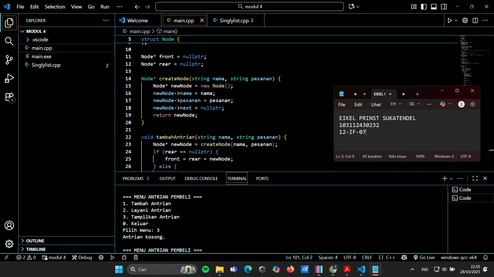
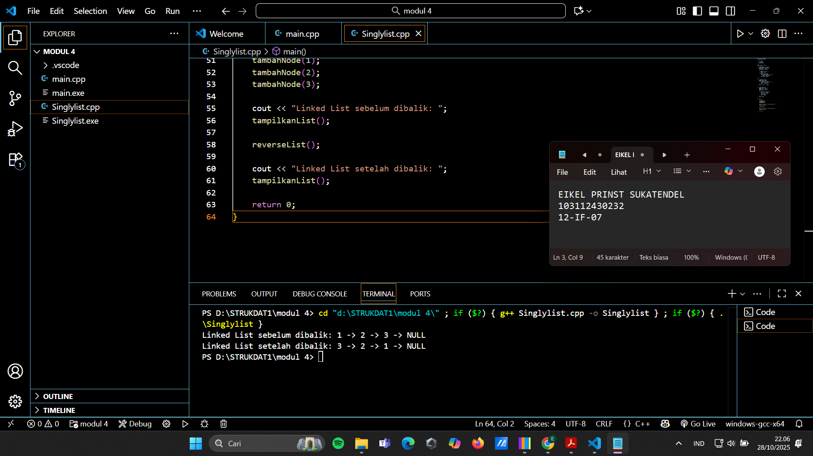

# <h1 align="center">Laporan Praktikum Modul 4 <br> Tambah antrian</h1>
<p align="center">EIKEL PRINST SUKATENDEL - 103112430232</p>

## Dasar Teori

teori dalam modul ke 4 ini adalah hanya memahami apa itu node. Node elemen dasar pada linked list yang berisi data dan pointer ke node berikutnya.
Contohnya:
struct Node {
    int info;
    Node* next;
};

Fungsinya:


Menyimpan data.


Menghubungkan satu elemen dengan elemen lain (membentuk rantai).


Dipakai dalam operasi seperti tambah, hapus, dan tampilkan data di linked list.


## Guided

### soal 1

aku mengerjakan buat nambah node baru untuk tambah antrian, layani antrian, layani antrian( bisa juga menghapus dari list) dan tampilan list antrian

## Unguided

### Soal 1


```go
#include <iostream>
#include <string>
using namespace std;

struct Node {
    string nama;
    string pesanan;
    Node* next;
};

Node* front = nullptr;
Node* rear = nullptr;

Node* createNode(string nama, string pesanan) {
    Node* newNode = new Node();
    newNode->nama = nama;
    newNode->pesanan = pesanan;
    newNode->next = nullptr;
    return newNode;
}

void tambahAntrian(string nama, string pesanan) {
    Node* newNode = createNode(nama, pesanan);
    if (rear == nullptr) {
        front = rear = newNode;
    } else {
        rear->next = newNode;
        rear = newNode;
    }
    cout << "Pembeli " << nama << " dengan pesanan \"" << pesanan << "\" ditambahkan ke antrian.\n";
}

void layaniAntrian() {
    if (front == nullptr) {
        cout << "Antrian kosong, tidak ada yang dilayani.\n";
        return;
    }
    Node* temp = front;
    cout << "Melayani pembeli " << front->nama << " (pesanan: " << front->pesanan << ")\n";
    front = front->next;
    if (front == nullptr) {
        rear = nullptr;
    }
    delete temp;
}

void tampilkanAntrian() {
    if (front == nullptr) {
        cout << "Antrian kosong.\n";
        return;
    }
    Node* temp = front;
    cout << "\n=== Daftar Antrian Pembeli ===\n";
    while (temp != nullptr) {
        cout << "- " << temp->nama << " (Pesanan: " << temp->pesanan << ")\n";
        temp = temp->next;
    }
}

int main() {
    int pilihan;
    string nama, pesanan;

    do {
        cout << "\n=== MENU ANTRIAN PEMBELI ===\n";
        cout << "1. Tambah Antrian\n";
        cout << "2. Layani Antrian\n";
        cout << "3. Tampilkan Antrian\n";
        cout << "0. Keluar\n";
        cout << "Pilih menu: ";
        cin >> pilihan;

        switch (pilihan) {
            case 1:
                cout << "Masukkan nama pembeli: ";
                cin.ignore();
                getline(cin, nama);
                cout << "Masukkan pesanan: ";
                getline(cin, pesanan);
                tambahAntrian(nama, pesanan);
                break;

            case 2:
                layaniAntrian();
                break;

            case 3:
                tampilkanAntrian();
                break;

            case 0:
                cout << "Program selesai.\n";
                break;

            default:
                cout << "Pilihan tidak valid!\n";
        }
    } while (pilihan != 0);

    return 0;
}
```

> Output
> 

Program ini membuat antrian pembeli dengan linked list (konsep Queue: FIFO).

struct Node menyimpan nama, pesanan, dan pointer next ke pembeli berikutnya.

front = pembeli pertama (paling depan), rear = pembeli terakhir.

createNode() → buat node baru.

tambahAntrian() → tambahkan pembeli ke akhir antrian.

layaniAntrian() → hapus pembeli terdepan (dilayani).

tampilkanAntrian() → tampilkan seluruh isi antrian.

main() → menampilkan menu pilihan (tambah, layani, tampilkan, keluar).

### Soal 2


```go
#include <iostream>
using namespace std;

struct Node {
    int data;
    Node* next;
};

Node* head = nullptr;

void tambahNode(int nilai) {
    Node* baru = new Node();
    baru->data = nilai;
    baru->next = nullptr;

    if (head == nullptr) {
        head = baru;
    } else {
        Node* temp = head;
        while (temp->next != nullptr)
            temp = temp->next;
        temp->next = baru;
    }
}

void tampilkanList() {
    Node* temp = head;
    while (temp != nullptr) {
        cout << temp->data << " -> ";
        temp = temp->next;
    }
    cout << "NULL" << endl;
}

void reverseList() {
    Node* prev = nullptr;
    Node* curr = head;
    Node* next = nullptr;

    while (curr != nullptr) {
        next = curr->next;   
        curr->next = prev;   
        prev = curr;         
        curr = next;         
    }
    head = prev; 
}

int main() {

    tambahNode(1);
    tambahNode(2);
    tambahNode(3);

    cout << "Linked List sebelum dibalik: ";
    tampilkanList();

    reverseList();

    cout << "Linked List setelah dibalik: ";
    tampilkanList();

    return 0;
}
```

> Output
> 

Program ini membuat linked list sederhana dan bisa membalik urutannya (reverse).

struct Node menyimpan data dan pointer next ke node berikutnya.

tambahNode() → menambahkan data di akhir list.

tampilkanList() → menampilkan semua isi list dari awal ke akhir.

reverseList() → membalik urutan node (node terakhir jadi pertama).

main() → menambah 3 data, menampilkan sebelum & sesudah dibalik.


## Referensi

1. https://www.programiz.com/cpp-programming/examples/linked-list(diakses dalam pengertian cpp lengkap)
