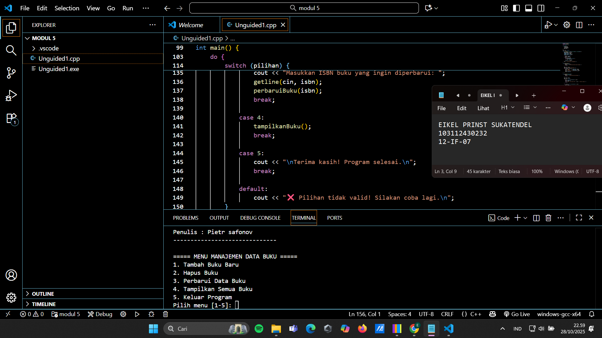

# <h1 align="center">Laporan Praktikum Modul 5 <br> Linked List</h1>
<p align="center">EIKEL PRINST SUKATENDEL - 103112430232</p>

## Dasar Teori

Linked List adalah struktur data dinamis yang terdiri dari beberapa elemen (node) yang saling terhubung melalui pointer.
Setiap node biasanya berisi dua bagian:

Data – menyimpan nilai atau informasi (misalnya ISBN, judul, penulis).

Pointer (next) – menunjuk ke node berikutnya dalam daftar.

Berbeda dengan array, linked list tidak memiliki ukuran tetap dan memungkinkan penambahan atau penghapusan data secara fleksibel tanpa perlu menggeser elemen lain.

## Guided

### soal 1

aku mengerjakan membuat menu buku, yang dimana perintahnya untuk membuat tambah buku baru, hapus buku (jika ada yang tidak dibutuhkan), perbarui data buku( lebih tepatnya mengganti buku yang sudah ada dengan buku yang baru)
tampilkan semua buku layaknya seperti perpustakaan yang dimana ada rak buku yang begitu banyak buku yang ditampilkan di rak tersebut dan itu ketentuan jumlah buku

## Unguided

### Soal 1


```go
#include <iostream>
#include <string>
using namespace std;

struct Buku {
    string isbn;
    string judul;
    string penulis;
    Buku* next;
};

Buku* head = nullptr;

void tambahBuku(string isbn, string judul, string penulis) {
    Buku* nodeBaru = new Buku;
    nodeBaru->isbn = isbn;
    nodeBaru->judul = judul;
    nodeBaru->penulis = penulis;
    nodeBaru->next = nullptr;

    if (head == nullptr) {
        head = nodeBaru;
    } else {
        Buku* temp = head;
        while (temp->next != nullptr) {
            temp = temp->next;
        }
        temp->next = nodeBaru;
    }
    cout << "✅ Buku berhasil ditambahkan!\n";
}

void tampilkanBuku() {
    if (head == nullptr) {
        cout << "⚠️  Belum ada data buku yang tersimpan.\n";
        return;
    }

    Buku* temp = head;
    cout << "\n=== DAFTAR DATA BUKU ===\n";
    while (temp != nullptr) {
        cout << "ISBN    : " << temp->isbn << endl;
        cout << "Judul   : " << temp->judul << endl;
        cout << "Penulis : " << temp->penulis << endl;
        cout << "------------------------------\n";
        temp = temp->next;
    }
}

void hapusBuku(string isbn) {
    if (head == nullptr) {
        cout << "⚠️  Tidak ada data untuk dihapus.\n";
        return;
    }

    Buku* temp = head;
    Buku* prev = nullptr;

    if (temp != nullptr && temp->isbn == isbn) {
        head = temp->next;
        delete temp;
        cout << "🗑️  Buku dengan ISBN " << isbn << " berhasil dihapus.\n";
        return;
    }

    while (temp != nullptr && temp->isbn != isbn) {
        prev = temp;
        temp = temp->next;
    }

    if (temp == nullptr) {
        cout << "❌ Buku dengan ISBN " << isbn << " tidak ditemukan.\n";
        return;
    }

    prev->next = temp->next;
    delete temp;
    cout << "🗑️  Buku berhasil dihapus.\n";
}

void perbaruiBuku(string isbn) {
    Buku* temp = head;

    while (temp != nullptr) {
        if (temp->isbn == isbn) {
            cout << "Masukkan judul baru   : ";
            getline(cin, temp->judul);
            cout << "Masukkan penulis baru : ";
            getline(cin, temp->penulis);
            cout << "✅ Data buku berhasil diperbarui.\n";
            return;
        }
        temp = temp->next;
    }

    cout << "❌ Buku dengan ISBN " << isbn << " tidak ditemukan.\n";
}

int main() {
    int pilihan;
    string isbn, judul, penulis;

    do {
        cout << "\n===== MENU MANAJEMEN DATA BUKU =====\n";
        cout << "1. Tambah Buku Baru\n";
        cout << "2. Hapus Buku\n";
        cout << "3. Perbarui Data Buku\n";
        cout << "4. Tampilkan Semua Buku\n";
        cout << "5. Keluar Program\n";
        cout << "Pilih menu [1-5]: ";
        cin >> pilihan;
        cin.ignore();

        switch (pilihan) {
            case 1:
                cout << "\n--- Tambah Buku Baru ---\n";
                cout << "ISBN    : ";
                getline(cin, isbn);
                cout << "Judul   : ";
                getline(cin, judul);
                cout << "Penulis : ";
                getline(cin, penulis);
                tambahBuku(isbn, judul, penulis);
                break;

            case 2:
                cout << "\n--- Hapus Buku ---\n";
                cout << "Masukkan ISBN buku yang ingin dihapus: ";
                getline(cin, isbn);
                hapusBuku(isbn);
                break;

            case 3:
                cout << "\n--- Perbarui Buku ---\n";
                cout << "Masukkan ISBN buku yang ingin diperbarui: ";
                getline(cin, isbn);
                perbaruiBuku(isbn);
                break;

            case 4:
                tampilkanBuku();
                break;

            case 5:
                cout << "\nTerima kasih! Program selesai.\n";
                break;

            default:
                cout << "❌ Pilihan tidak valid! Silakan coba lagi.\n";
        }

    } while (pilihan != 5);

    return 0;
}

```

> Output
> 

Program ini digunakan untuk mengelola data buku (tambah, hapus, ubah, tampilkan) menggunakan Linked List dalam C++.

struct Buku → menyimpan ISBN, judul, penulis, dan pointer next ke buku berikutnya.

head → menunjuk ke buku pertama dalam daftar.

🔹 tambahBuku()

Menambahkan buku baru ke akhir list.

🔹 tampilkanBuku()

Menampilkan semua buku yang tersimpan dalam list.

🔹 hapusBuku()

Menghapus buku berdasarkan ISBN yang dicari.

🔹 perbaruiBuku()

Mengubah judul dan penulis buku berdasarkan ISBN.

🔹 main()

Menampilkan menu interaktif untuk memilih fitur: tambah, hapus, ubah, tampilkan, atau keluar.


## Referensi

1. https://www.programiz.com/cpp-programming/examples/linked-list (diakses untuk belajar bahasa c++)
